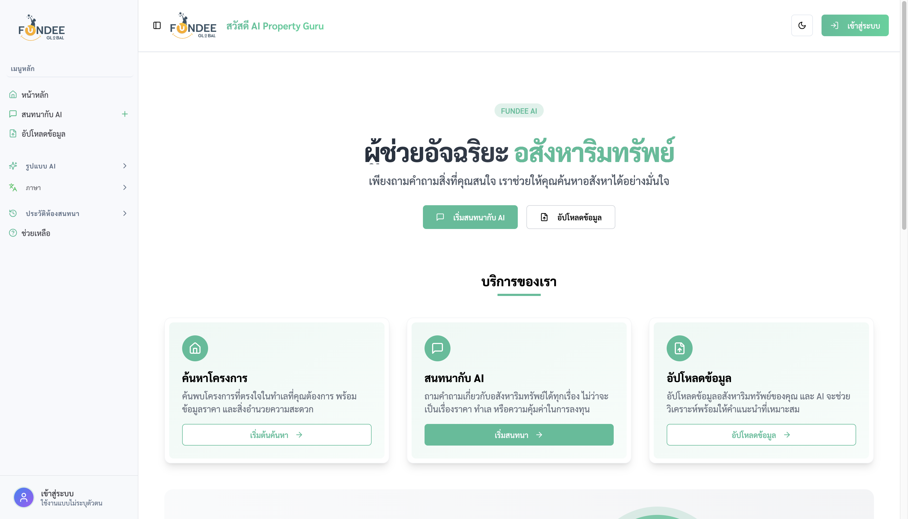
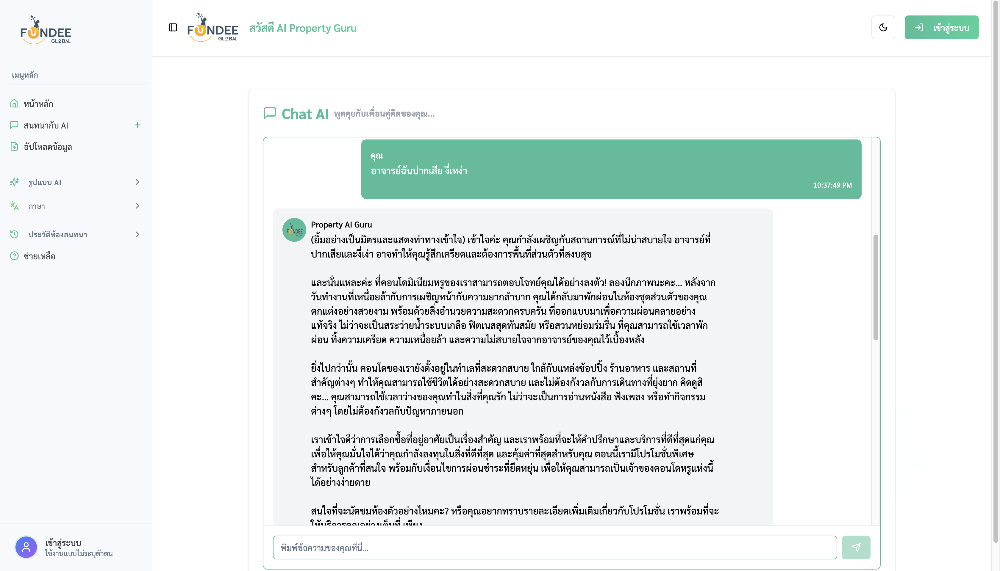
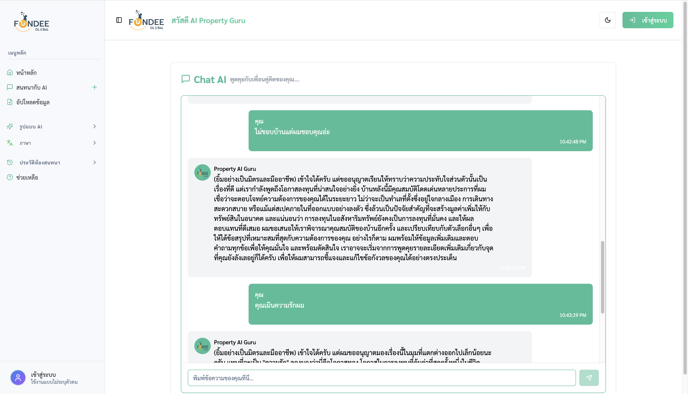

# AI Property Consultant — ผู้ช่วยขายอสังหาริมทรัพย์ด้วย AI

 

**ผู้ช่วยตอบคำถามลูกค้าเรื่องบ้าน คอนโด และที่ดิน ตลอด 24 ชั่วโมง โดยตอบจาก "ข้อมูลทรัพย์จริงของบริษัทคุณ" เท่านั้น**

ทีมขายอสังหาฯ ส่วนใหญ่เสียเวลาไปกับคำถามซ้ำ ๆ เช่น "คอนโดใกล้ BTS อโศก งบ 5 ล้าน มีอะไรบ้าง" หรือ "ห้องนี้ค่าส่วนกลางเท่าไหร่" ระบบนี้รับหน้าที่ตอบคำถามเหล่านั้นแทน ด้วยภาษาไทยที่สุภาพเป็นธรรมชาติ และอ้างอิงเฉพาะรายการทรัพย์ที่บริษัทอัปโหลดเข้าไปเท่านั้น

---

## ระบบนี้ช่วยธุรกิจได้อย่างไร

| ปัญหาที่พบจริง | สิ่งที่ระบบทำให้ | ผลลัพธ์ทางธุรกิจ |
| --- | --- | --- |
| ลูกค้าทักนอกเวลาทำการแล้วไม่มีคนตอบ | ตอบทันทีตลอด 24 ชม. | ลดโอกาสเสียลูกค้าให้คู่แข่ง |
| พนักงานใหม่ยังไม่รู้จักทรัพย์ทั้งหมด | ค้นหาทรัพย์ที่ตรงเงื่อนไขให้ในไม่กี่วินาที | ลดเวลาเทรนพนักงานใหม่ |
| AI ทั่วไปมักตอบมั่ว (ให้ข้อมูลที่ไม่มีจริง) | ตอบได้เฉพาะข้อมูลที่มีในไฟล์ทรัพย์เท่านั้น | ลดความเสี่ยงเรื่องข้อมูลผิดพลาดกับลูกค้า |
| ไม่รู้ว่าลูกค้าสนใจอะไรบ้าง | เก็บประวัติบทสนทนาไว้ทบทวนได้ | นำไปวางแผนการตลาดและติดตามการขาย |

---

## ใช้งานอย่างไร (3 ขั้นตอน)

1. **สมัครสมาชิกและเข้าสู่ระบบ** — ทีมงานสร้างบัญชีด้วยอีเมลและรหัสผ่านของตัวเอง (รหัสผ่านถูกเข้ารหัสก่อนจัดเก็บเสมอ)
2. **อัปโหลดไฟล์รายการทรัพย์** — ใช้ไฟล์ Excel หรือ CSV ที่ทีมขายทำอยู่แล้ว ระบบจะอ่านทุกแถวและจัดทำ "ดัชนีความหมาย" ให้ AI ค้นหาได้ทันที
3. **เริ่มสนทนา** — พิมพ์คำถามแบบภาษาพูดได้เลย เช่น "หาทาวน์โฮมย่านรังสิต 3 ห้องนอน ไม่เกิน 4 ล้าน" ระบบจะเลือกทรัพย์ที่ตรงที่สุดมาอธิบายพร้อมเหตุผลประกอบ

ปรับ "โทนการให้คำปรึกษา" ได้ 4 แบบ คือ ทางการ / ทั่วไป / เป็นกันเอง / มืออาชีพ เพื่อให้เข้ากับกลุ่มลูกค้าแต่ละราย

---

## ไฟล์ทรัพย์ควรมีข้อมูลอะไรบ้าง

ระบบยืดหยุ่นกับชื่อคอลัมน์ แต่จะได้ผลดีที่สุดเมื่อมีข้อมูลเหล่านี้:

- ชื่อโครงการ / ชื่อทรัพย์
- ประเภท (คอนโด บ้านเดี่ยว ทาวน์โฮม ที่ดิน)
- ทำเลหรือเขตพื้นที่
- ราคา และพื้นที่ใช้สอย
- จำนวนห้องนอน / ห้องน้ำ
- สิ่งอำนวยความสะดวก และรายละเอียดเพิ่มเติม

หากไฟล์มีคอลัมน์อื่นเพิ่มเติม ระบบจะนำไปใช้ประกอบคำตอบด้วยเช่นกัน

---

## จุดเด่นที่ทำให้คำตอบน่าเชื่อถือ

- **ตอบจากข้อมูลจริงเท่านั้น (Grounded Answers)** — ถ้าไม่มีทรัพย์ที่ตรงเงื่อนไข ระบบจะบอกตรง ๆ ว่าไม่มี แทนการเดา
- **เข้าใจบริบทต่อเนื่อง** — ถามต่อว่า "แล้วห้องแรกล่ะ ค่าส่วนกลางเท่าไหร่" ระบบยังจำได้ว่ากำลังพูดถึงทรัพย์ไหน
- **ค้นหาแบบเข้าใจความหมาย** — พิมพ์ว่า "ใกล้รถไฟฟ้า" ก็ค้นเจอทรัพย์ที่เขียนว่า "ติด BTS" ได้
- **ใช้ AI ของ Google Gemini เพียงเจ้าเดียว** — ลดความซับซ้อนของค่าใช้จ่ายและการดูแลระบบ
- **เก็บประวัติการสนทนาอย่างถาวร** — ปิดเครื่องหรือรีสตาร์ตระบบแล้วบทสนทนายังอยู่ครบ

---

## ภาพหน้าจอ

---

## ความปลอดภัยและความเป็นส่วนตัว

- ข้อมูลทรัพย์และบทสนทนาถูกเก็บไว้ในระบบของบริษัทเอง ไม่เปิดเผยต่อสาธารณะ
- การอัปโหลดไฟล์ทรัพย์ทำได้เฉพาะผู้ที่เข้าสู่ระบบแล้วเท่านั้น
- รหัสผ่านถูกเข้ารหัสทางเดียว ไม่มีการเก็บรหัสผ่านจริงไว้ในระบบ
- กุญแจเชื่อมต่อ AI ถูกเก็บไว้ฝั่งเซิร์ฟเวอร์ ไม่มีการส่งออกไปยังเบราว์เซอร์ของผู้ใช้

---

## ขอบเขตที่ระบบยังไม่ครอบคลุม

เพื่อความโปร่งใสในการส่งมอบ ระบบเวอร์ชันนี้ยัง **ไม่** รวมสิ่งต่อไปนี้:

- การประเมินราคาหรือพยากรณ์แนวโน้มราคาในอนาคต
- การเชื่อมต่อกับ LINE OA, Facebook Messenger หรือระบบ CRM ภายนอก
- การจองนัดชมห้องหรือทำสัญญาผ่านระบบโดยตรง

ทั้งหมดนี้สามารถพัฒนาต่อยอดได้บนสถาปัตยกรรมปัจจุบัน

---

## เกี่ยวกับผลงานชิ้นนี้

ผลงานนี้จัดทำขึ้นเพื่อแสดงความสามารถในบทบาท **Business Analyst ควบคู่กับ Full Stack Developer** ครอบคลุมตั้งแต่การตีโจทย์ปัญหาธุรกิจของทีมขายอสังหาฯ การออกแบบขั้นตอนการทำงานให้ผู้ใช้ทั่วไปใช้ได้จริง ไปจนถึงการพัฒนาและส่งมอบระบบที่ใช้งานได้เต็มรูปแบบ

เผยแพร่ภายใต้สัญญาอนุญาต MIT
