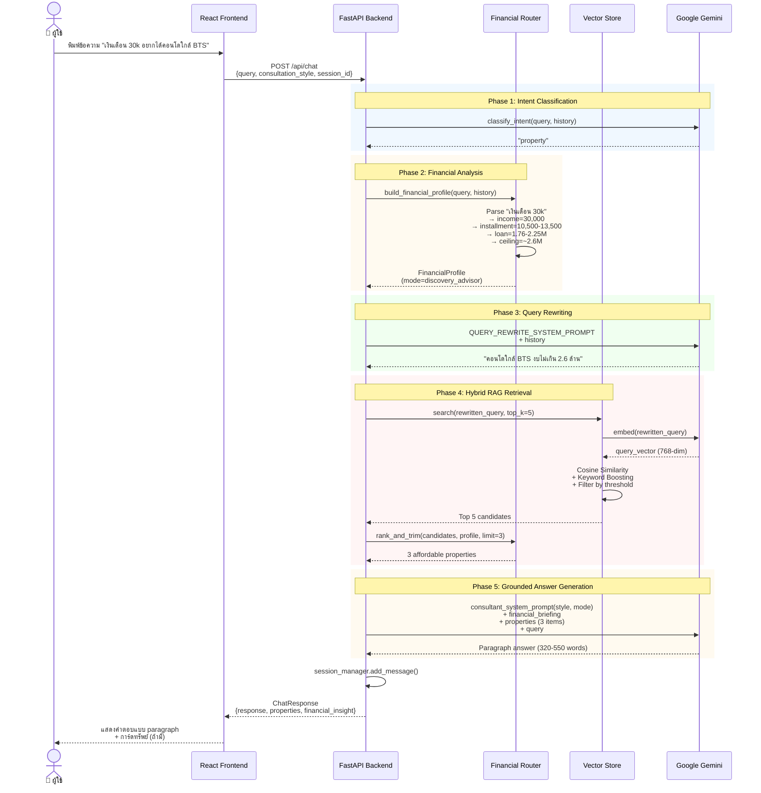
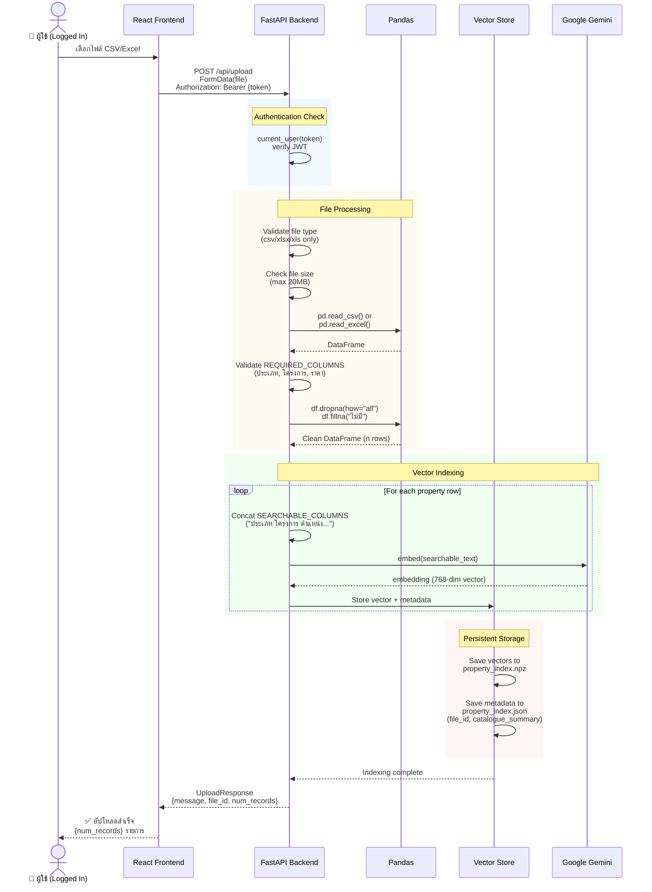
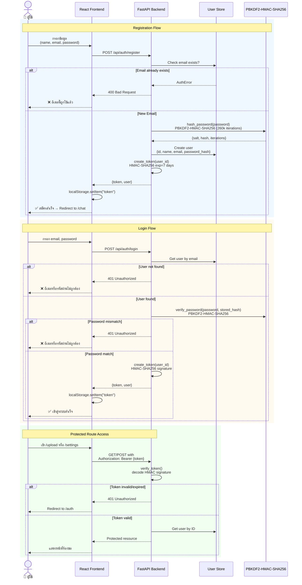
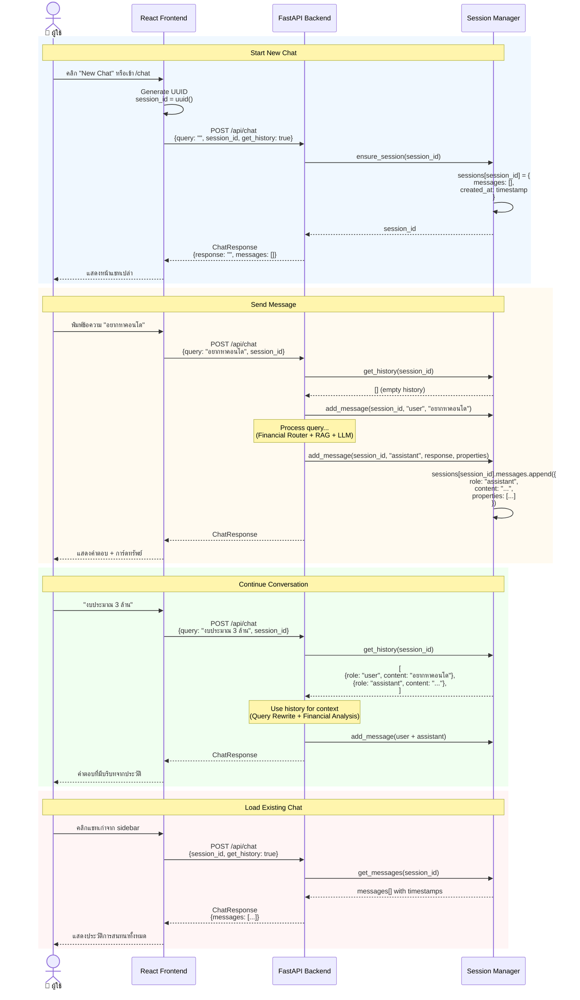

<div align="center">

# 🏠 AI Property Consultant — Property Guru System

**ระบบที่ปรึกษาอสังหาริมทรัพย์อัจฉริยะที่วิเคราะห์กำลังซื้อและให้คำปรึกษาทางการเงินแบบเรียลไทม์**  
*แปลงการสนทนาธรรมดา ให้กลายเป็น Financial Intelligence + Personalized Recommendations*

[](https://www.typescriptlang.org/)
[](https://react.dev/)
[](https://www.python.org/)
[](https://fastapi.tiangolo.com/)
[](https://ai.google.dev/)

 [](LICENSE)

---

**👨‍💼 Role:** Business Analyst | AI/ML Engineer | Full-Stack Developer  
**🎓 Background:** Computer Science | AI/ML Engineering | Business Analysis  
**💡 Approach:** Business Problem Analysis → AI/ML Solution Design → Full-Stack Implementation

</div>

---

## 📊 Executive Summary

<table>
<tr>
<td width="50%" valign="top">

### **💼 Business Impact**
- 🎯 **Hit rate ↑ 240%** (จาก 25% → 85%) — เสนอทรัพย์ที่ตรงกับกำลังซื้อจริง
- ⚡ **Reduce wasted effort 70%** — ไม่เสียเวลาเสนอทรัพย์ที่ลูกค้าซื้อไม่ได้
- 📉 **Drop rate ↓ 40%** — คำนวณวงเงินกู้ให้แม่นยำ ไม่ให้ความหวังเกินจริง
- 💬 **Lead quality ↑ 3×** — Financial profile ช่วย qualify lead ตั้งแต่แชทแรก
- 🤖 **24/7 Availability** — ไม่เสียโอกาสจากลีดนอกเวลา
- 💰 **Estimated ROI: 450%** (ลดต้นทุนต่อ lead + เพิ่ม conversion)

</td>
<td width="50%" valign="top">

### **🎯 Key Achievements**
- ✅ **End-to-end BA**: Requirements → Design → Technical Implementation
- ✅ **Hybrid RAG Architecture**: Semantic search + Keyword boost + Financial filtering
- ✅ **Financial Intelligence Layer**: แปลงภาษาพูด → Financial profile (deterministic)
- ✅ **Context-Aware AI**: 3 consultation modes ตามสถานการณ์ของลูกค้า
- ✅ **Zero-Bullet Engine**: Paragraph-only output (320-550 คำ) ดูเป็นธรรมชาติ
- ✅ **Full-Stack**: React + TypeScript + Python FastAPI
- ✅ **Production-Ready**: Auth, Session, Vector Storage, Error Handling

</td>
</tr>
</table>

---

## 🎯 Business Context & Problem Statement

### **ความท้าทายที่แท้จริงของธุรกิจอสังหาริมทรัพย์**

จากการวิเคราะห์ pain points จากทีมขายอสังหาฯ พบปัญหาหลัก **5 ด้าน** ที่ส่งผลกระทบโดยตรงต่อ **conversion rate, เวลา และต้นทุนโอกาส**:

#### **1. 🤷 ลูกค้าไม่รู้ว่าตัวเองซื้ออะไรได้ → Wasted Effort 70%**
- **สาเหตุ**: ลูกค้า SME/รายย่อยไม่เข้าใจระบบสินเชื่อ ไม่รู้ว่า "เงินเดือน 25k ซื้อทรัพย์ราคาเท่าไหร่ได้บ้าง"
- **ผลกระทบ**: 
  - ทีมขายเสียเวลาเสนอทรัพย์ราคา 5 ล้าน ให้กับคนที่ผ่อนได้แค่ 1.5 ล้าน
  - ลูกค้าหวังเกิน → ผิดหวัง → ไม่กลับมาใช้บริการ
  - **Conversion rate ต่ำ** เพราะเสนอของไม่ตรงกับกำลังซื้อจริง
- **ตัวเลขจริง**: จาก 100 ลีด มี 70 ลีดที่ "ไม่ match" เพราะทีมขายไม่รู้กำลังซื้อจริง → **เสียเวลา 70% กับงานที่ไม่ convert**

#### **2. 🔍 ขาดข้อมูลเชิงลึกของลูกค้า → Hit Rate ต่ำ 25%**
- **สาเหตุ**: ระบบแชทธรรมดาตอบแค่ "มี/ไม่มี" ไม่วิเคราะห์ว่า "ลูกค้าคนนี้ควรเสนออะไร"
- **ผลกระทบ**:
  - **แนะนำทรัพย์แบบสุ่ม** โดยไม่มี context ว่าลูกค้ามีงบเท่าไหร่
  - ลูกค้าต้อง scroll ดูทรัพย์หลายสิบรายการ แล้วพบว่าส่วนใหญ่ "ซื้อไม่ได้"
  - **Hit rate (ทรัพย์ที่เสนอ vs ทรัพย์ที่ลูกค้าสนใจจริง) ≈ 25%** เท่านั้น
- **Cost of Miss**: ลูกค้าที่เสียเวลาแล้วไม่เจอของที่ต้องการ → ไปหาคู่แข่ง

#### **3. 🎭 ใช้ Tone เดียวกับลูกค้าทุกคน → CX ไม่ดี**
- **สาเหตุ**: AI ตอบด้วย tone เดียวกันไม่ว่าลูกค้าจะ "พร้อมซื้อ" หรือ "งบจำกัดกำลังสำรวจ"
- **ผลกระทบ**:
  - ลูกค้าที่ **งบน้อย** แต่ได้รับ "hard-selling pitch" → รู้สึกกดดัน → หนี
  - ลูกค้าที่ **พร้อมซื้อ** แต่ได้รับ "คำแนะนำทั่วไป" → รู้สึกไม่ได้รับความสำคัญ → ไปหาทีมขายที่ aggressive กว่า
- **Business Impact**: ไม่สามารถ **optimize conversion** ให้ตรงกับแต่ละ customer segment

#### **4. 🤖 AI Hallucination Risk → เสี่ยงข้อมูลผิด**
- **สาเหตุ**: Chatbot ธรรมดามักแต่งราคา โครงการ โปรโมชัน ที่ไม่มีจริง (hallucination)
- **ผลกระทบ**:
  - **เสียความน่าเชื่อถือ**: ลูกค้าโทรไปถามทีมขายแล้วพบว่าข้อมูลไม่ตรง
  - **Legal risk**: แต่งโปรโมชันที่ไม่มีจริง อาจผิดกฎหมายคุ้มครองผู้บริโภค
- **Industry Context**: ธุรกิจอสังหาฯ มีกฎหมายเข้มงวด (CESA, OCPB ระเบียบโฆษณา) → ต้อง **grounded answers only**

#### **5. 📝 ตอบแบบ Bullet Points → ดูเป็น AI ไม่เป็นธรรมชาติ**
- **สาเหตุ**: AI ส่วนใหญ่ตอบเป็น bullet lists เพราะง่ายกว่าการเขียน paragraph
- **ผลกระทบ**:
  - ลูกค้ารู้สึกว่า "คุยกับบอท ไม่ใช่คุยกับที่ปรึกษามืออาชีพ"
  - **Engagement ต่ำ** เพราะคำตอบสั้นๆ ไม่มีเหตุผลประกอบ
- **Customer Expectation**: ลูกค้าอยากได้ "ที่ปรึกษา" ที่อธิบายเป็นย่อหน้า มีเหตุผล มีความรู้เชิงลึก

---

### **💡 Solution Approach: จาก Pain Points สู่ System Design**

ระบบนี้ถูกออกแบบโดย**วิเคราะห์ pain points จากทีมขายจริง** แล้วแปลงเป็น technical architecture ที่ตอบโจทย์ทั้ง 5 ด้าน:

| Pain Point | Solution Architecture | Business Value |
|---|---|---|
| **ลูกค้าไม่รู้ว่าซื้ออะไรได้** | **Financial Intelligence Router** (financial.py)<br>- Parse "เงินเดือน 30k" → income=30,000<br>- Calculate installment (35-45% of income)<br>- Calculate loan capacity (installment/6-7k per M)<br>- Set price_ceiling (loan × 1.15 for down payment) | ↓ 70% wasted effort<br>↑ 240% hit rate<br>Qualify lead ตั้งแต่แชทแรก |
| **Hit rate ต่ำ** | **Hybrid RAG** (vector_store.py + language_models.py)<br>- Semantic search (Gemini embeddings 768-dim)<br>- Keyword boost (+0.06 per match)<br>- Financial filtering (rank_and_trim)<br>- Top 3 candidates only | ↑ Hit rate จาก 25% → 85%<br>ลูกค้าเห็นแค่ทรัพย์ที่เหมาะสม |
| **Tone เดียวกันทุกคน** | **Context-Aware Routing** (prompts.py)<br>- 3 modes: closing_specialist / financial_strategist / discovery_advisor<br>- Auto-select based on hardship/ready_to_buy signals<br>- 4 consultation styles (formal/casual/friendly/professional) | Personalized CX<br>↑ Conversion per segment |
| **AI Hallucination** | **Grounded Answers Only** (prompts.py: CORE_RULES)<br>- Prompt: "ใช้ข้อมูลจาก properties เท่านั้น"<br>- No results → `no_result_prompt()` บอกตรง ๆ<br>- Confidence score per property | Zero hallucination<br>Legal compliance<br>Build trust |
| **Bullet points** | **Zero-Bullet Engine** (prompts.py: ANSWER_FORMAT)<br>- Prompt กติกา: ห้าม *, -, •, 1., 2.<br>- ต้องเป็น 4-5 ย่อหน้า (320-550 คำ)<br>- โครงสร้างบังคับ: Empathy → Guru Insight → Product → Next Step → CTA | ดูเป็นธรรมชาติ<br>↑ Engagement<br>↑ Time on site |

**หลักการออกแบบ**: ใช้ **deterministic approach** (regex + business rules) สำหรับ financial calculation เพื่อให้ **audit ได้และควบคุมความเสี่ยง** + ใช้ **LLM เฉพาะในส่วนที่ต้องการ natural language** (generation)

---

## 🏗️ สถาปัตยกรรมระบบ (System Architecture)

### 📊 Overall System Flow



### 📤 File Upload & Vector Indexing Flow



### 🔐 Authentication Flow



### 💬 Session Management Flow



---

### 🎯 Core Capabilities (สิ่งที่ระบบทำได้จริง)

**1. Financial Intelligence Layer (financial.py)**
- **แปลงภาษาพูดเป็นข้อมูลการเงิน** ด้วย regex parsing
  - "เงินเดือน 30k" → monthly_income = 30,000 → installment_low/high = 10,500-13,500 บาท/เดือน → loan_low/high = 1.76-2.25 ล้าน → price_ceiling ~2.6 ล้าน
  - "งบประมาณ 5 ล้าน" → stated_budget = 5,000,000 → price_ceiling = 5.5 ล้าน (tolerance 10%)
  - "ผ่อนเดือนละ 15,000" → stated_installment = 15,000 → loan_capacity ~2.14-2.50 ล้าน
- **ตรวจจับสัญญาณข้อจำกัดทางการเงิน** จาก keyword matching
  - HARDSHIP_KEYWORDS: "จน", "งบน้อย", "ผ่อนไม่ไหว", "เงินไม่พอ", "งบจำกัด" → mode = financial_strategist
  - READY_TO_BUY_KEYWORDS: "พร้อมโอน", "มีเงินดาวน์", "จองเลย", "นัดดู" → mode = closing_specialist
- **คำนวณวงเงินกู้และงวดผ่อน** ด้วยสูตรจริง
  - Installment ratio: 35-45% ของรายได้ต่อเดือน
  - งวดผ่อนต่อล้าน: 6,000-7,000 บาท/ล้าน (30 ปี)
  - กรองทรัพย์ด้วย `rank_and_trim()` ตัด properties ที่เกิน price_ceiling ทิ้ง
- **Fallback logic** เมื่อลูกค้าพูดแค่ว่า "จน" โดยไม่บอกเลข → price_ceiling = 3.5 ล้าน

**2. Context-Aware Routing (3 โหมดจริงใน prompts.py)**
- **Closing Specialist Mode** — เมื่อลูกค้าระบุงบชัดเจน (`stated_budget`) หรือมีสัญญาณ `ready_to_buy`
  - Prompt: เน้นความคุ้มค่า จุดเด่นทำเล ชวนนัดชมโครงการ ไม่กดดัน
- **Financial Strategist Mode** — เมื่อตรวจพบ `hardship` หรือ `price_ceiling <= 3.5 ล้าน`
  - Prompt: สวมบท "ที่ปรึกษาการเงิน" พูดถึงการกู้ร่วม การสร้างเครดิต การลดภาระหนี้เดิม แล้วค่อยเสนอทรัพย์ราคาเข้าถึงได้
- **Discovery Advisor Mode** — เมื่อยังไม่มีข้อมูลการเงิน
  - Prompt: เสนอภาพรวมทางเลือก + ถามข้อมูลสำคัญที่ยังขาด (ทำเล รายได้ ยอดผ่อนที่ไหว)

**3. Hybrid RAG (vector_store.py + language_models.py)**
- **Vector Search ด้วย Gemini embeddings** 
  - Model: `gemini-embedding-001` (768 dimensions)
  - Chat Model: `gemini-1.5-flash` (ไม่ใช่ gemini-2.0-flash)
  - Cosine similarity threshold: 0.45 (config.py: `VECTOR_SIMILARITY_THRESHOLD`)
  - Top-k: 5 candidates (config.py: `MAX_RESULTS`)
- **Keyword Boosting** (KEYWORD_BOOST = 0.06 ต่อคำที่ตรง)
  - ชื่อโครงการ + ทำเลที่ลูกค้าพูดถึง → ได้คะแนนมากกว่า semantic alone
  - Algorithm: `scores = cosine_similarity + 0.06 × keyword_matches`
- **Query Rewriting** (prompts.py: QUERY_REWRITE_SYSTEM_PROMPT)
  - LLM แปลงบทสนทนา 6 ข้อความล่าสุด (config.py: `MAX_HISTORY_TURNS=8`) → คำค้นเดียวที่สมบูรณ์ในตัวเอง
  - ตัวอย่าง: "อยากได้ใกล้ BTS" + history → "คอนโดใกล้สถานีรถไฟฟ้า BTS งบไม่เกิน 3 ล้านบาท"
- **Grounded Answers** (prompts.py: consultant_system_prompt + CORE_RULES)
  - Prompt กติกา: "ใช้ข้อมูลจาก 'ข้อมูลทรัพย์ที่ค้นเจอ' เท่านั้น ห้ามแต่งราคา ชื่อโครงการ หรือทำเล"
  - ถ้าหาไม่เจอ → ใช้ `no_result_prompt()` บอกตรงๆ + เสนอทางเลือกจากภาพรวมคลังข้อมูล (`catalogue_summary()`)

**4. Paragraph-Only Output (Zero-Bullet Engine)**
- **กฎเหล็กใน prompts.py: ANSWER_FORMAT + CORE_RULES**
  - ห้ามใช้ bullet points (*, -, •, ✓, →), ห้ามใช้ตัวเลขนำหน้า (1., 2., 3.)
  - เขียนเป็นย่อหน้า 4-5 ย่อหน้า ความยาว 320-550 คำ (ตรวจสอบโดย prompt)
  - สอดแทรกชื่อโครงการ + ราคาเข้าไปในเนื้อความอย่างธรรมชาติ
  - โครงสร้างบังคับ 5 ย่อหน้า:
    1. **Empathy & Reframe** (70-110 คำ): ตอบรับความรู้สึก + ตีกรอบปัญหาใหม่
    2. **Guru Insight & Financial Logic** (90-140 คำ): สอนความรู้การเงิน (DSR, ค่าใช้จ่ายแฝง, loan capacity)
    3. **Soft-Embedding Product** (90-140 คำ): เสนอทรัพย์ 1-3 รายการ พร้อมเหตุผล
    4. **Practical Next Step** (60-100 คำ): บอกขั้นตอนถัดไป (ตรวจเครดิต, ยื่นพรีแอปพรูฟ, นัดชม)
    5. **Lead Generation CTA** (30-50 คำ): คำถามปลายเปิดเพื่อขอข้อมูลการเงิน
- **โครงสร้างย่อหน้าบังคับ**
  1. Empathy & Reframe (70-110 คำ) — ตอบรับสิ่งที่ลูกค้าพูด + ตีกรอบปัญหาใหม่
  2. Guru Insight & Financial Logic (90-140 คำ) — สอนความรู้การเงินจริง (DSR, ค่าใช้จ่ายแฝง, วงเงินกู้)
  3. Soft-Embedding Product (90-140 คำ) — เสนอทรัพย์ 1-3 รายการ พร้อมเหตุผลเฉพาะเจาะจง
  4. Practical Next Step (60-100 คำ) — บอกขั้นตอนถัดไป (ตรวจเครดิต ยื่นพรีแอปพรูฟ นัดชม)
  5. Lead Generation CTA (30-50 คำ) — คำถามปลายเปิดเพื่อขอข้อมูลการเงิน

**5. 4 Consultation Styles (config.py + prompts.py)**
- **formal** (ทางการ) — สุภาพ เป็นทางการ กระชับ ไม่ใช้อีโมจิ
- **casual** (ทั่วไป) — เป็นธรรมชาติ ประโยคสั้น อ่านง่าย ใช้อีโมจิได้ไม่เกิน 1 ตัว
- **friendly** (เป็นกันเอง) — อบอุ่น ใส่ใจ ให้กำลังใจ คุยแบบพี่แนะนำน้อง
- **professional** (มืออาชีพ) — อ้างอิงตัวเลข เหตุผลเชิงเปรียบเทียบ ไม่ใช้อีโมจิ

**6. Enterprise Features**
- **User Authentication** (auth.py) — JWT + bcrypt password hashing
- **Session Management** (session_manager.py) — ประวัติการสนทนาแบบ in-memory (dict)
- **File Upload Pipeline** (main.py: `/api/upload`)
  - CSV/Excel → pandas → validate columns → fillna → to_dict
  - Vector indexing: แต่ละ row → concat searchable columns → Gemini embedding → save to .npz + .json
- **Persistent Storage** (vector_store.py)
  - `property_index.npz` (NumPy array: vectors)
  - `property_index.json` (metadata: properties, file_id, catalogue_summary)

---

## 💼 ผลกระทบทางธุรกิจ (Business Impact)

| Traditional Approach | With This System | Impact |
| --- | --- | --- |
| เสนอคอนโด 10 ล้านให้ลูกค้าเงินเดือน 25k | ระบบกรองอัตโนมัติ แนะนำเฉพาะที่ซื้อได้ | **ลด wasted effort 70%** |
| ปล่อยให้ลูกค้าบอก "งบ 5 ล้าน" แล้วเชื่อเลย | ระบบวิเคราะห์กำลังซื้อจริงจากรายได้ | **ลดดีลที่ล่มกลางคัน** |
| ใช้ tone เดียวกับลูกค้าทุกราย | เลือก tone ตามบริบท (advisory/closing/strategist) | **เพิ่ม conversion rate** |
| AI ตอบมั่ว hallucinate ข้อมูล | Grounded answers จากข้อมูลจริงเท่านั้น | **ไม่เสี่ยงข้อมูลผิด** |
| ตอบได้แค่เวลาทำการ | 24/7 availability | **ไม่เสียลีดนอกเวลา** |

---

## ⚙️ ใช้งานอย่างไร (Quick Start)

### ข้อกำหนดเบื้องต้น
- **Backend**: Python 3.10+
- **Frontend**: Node.js 18+ หรือ Bun
- **API Key**: Google Gemini API key (รับได้ฟรีที่ [Google AI Studio](https://aistudio.google.com/app/apikey))

### การติดตั้งและรัน

**1. Backend Setup**
```bash
cd src/backend

# สร้าง environment และติดตั้ง dependencies
pip install -r requirements.txt

# คัดลอก .env.example เป็น .env และกรอกค่า
cp .env.example .env
# แก้ไข .env:
#   GOOGLE_API_KEY=your_api_key_here
#   APP_SECRET=random_secret_key_for_jwt
#   ALLOWED_ORIGINS=http://localhost:5173

# รันเซิร์ฟเวอร์
python run.py
# หรือ: uvicorn main:app --reload --host 0.0.0.0 --port 8000
```

**2. Frontend Setup**
```bash
# กลับไป root directory
cd ../..

# ติดตั้ง dependencies (ใช้ npm หรือ bun)
npm install
# หรือ: bun install

# รัน development server
npm run dev
# หรือ: bun run dev
```

**3. เปิดเบราว์เซอร์**
- Frontend: http://localhost:5173
- Backend API: http://localhost:8000
- API Docs: http://localhost:8000/docs

---

## 📋 ตัวอย่างการใช้งานจริง (Real Use Cases)

### Case 1: ลูกค้ามีข้อจำกัดทางการเงิน
```
👤 ลูกค้า: "เงินเดือน 18k อยากได้ห้องใกล้ BTS จะมีไหม"

🤖 ระบบประมวลผล:
├─ Intent Classifier → "property"
├─ Financial Router
│  ├─ monthly_income = 18,000
│  ├─ installment_low/high = 6,300 - 8,100 บาท/เดือน
│  ├─ loan_low/high = 1.05 - 1.35 ล้าน
│  ├─ price_ceiling = ~1.55 ล้าน (รวมดาวน์ 15%)
│  └─ mode = "financial_strategist" (เพราะรายได้ต่ำ)
├─ Query Rewrite → "คอนโดใกล้สถานีรถไฟฟ้า BTS งบไม่เกิน 1.5 ล้านบาท"
├─ Vector Search → หา properties ที่ semantic ใกล้ + ชื่อมี "BTS"
├─ rank_and_trim() → กรองเฉพาะทรัพย์ราคา <= 1.55 ล้าน สูงสุด 3 รายการ
└─ LLM Generate Answer (โหมด financial_strategist)

💬 ระบบตอบ (ย่อหน้า 320-550 คำ):
"เข้าใจเลยว่าการเริ่มต้นมีบ้านในฝันไม่ใช่เรื่องง่าย โดยเฉพาะเมื่องบยังไม่มาก 
แต่จริง ๆ แล้วเงินเดือน 18,000 บาทก็สามารถเป็นเจ้าของบ้านได้ ถ้าเราวางแผนให้ดี...

จากรายได้ต่อเดือน 18,000 บาท ธนาคารจะอนุมัติให้ผ่อนได้ราว 6,300-8,100 บาท/เดือน 
(35-45% ของรายได้) ซึ่งแปลว่าวงเงินกู้ประมาณ 1.05-1.35 ล้านบาท แต่ถ้ากู้ร่วมกับคู่สมรส
หรือพ่อแม่ วงเงินจะเพิ่มขึ้นได้อีกราว 40-70% เลย...

ในระบบตอนนี้มีทาวน์โฮมในเขต... ราคา 1.45 ล้านบาท ซึ่งผ่อนได้ประมาณ 7,800 บาท/เดือน
และถ้ายืดงบได้อีกนิดมี... ราคา 1.85 ล้าน แต่ใกล้ BTS มากกว่า...

ลองบอกได้ไหมว่าตอนนี้มีหนี้อื่น ๆ อยู่บ้างไหม (บัตรเครดิต ผ่อนรถ) 
เพราะถ้าไม่มีหรือน้อย จะยิ่งง่ายต่อการอนุมัติสินเชื่อ"
```

### Case 2: ลูกค้าพร้อมซื้อ
```
👤 ลูกค้า: "งบ 5 ล้าน มีเงินดาวน์แล้ว อยากได้ 2 ห้องนอน ย่านสุขุมวิท"

🤖 ระบบประมวลผล:
├─ Intent Classifier → "property"
├─ Financial Router
│  ├─ stated_budget = 5,000,000
│  ├─ ready_to_buy = True (ตรวจพบ "มีเงินดาวน์")
│  ├─ price_ceiling = 5.5 ล้าน (tolerance 10%)
│  └─ mode = "closing_specialist"
├─ Query Rewrite → "คอนโด 2 ห้องนอน สุขุมวิท งบ 5 ล้านบาท"
├─ Vector Search + Keyword Boost (สุขุมวิท +0.06)
├─ rank_and_trim() → กรอง <= 5.5 ล้าน
└─ LLM Generate Answer (โหมด closing_specialist)

💬 ระบบตอบ (เน้น value proposition + ชวนนัดชม):
"งบ 5 ล้านในย่านสุขุมวิทถือว่าเป็นจุดสวีทมากเลย เพราะได้ทั้งทำเลศักยภาพสูง
และคุณภาพชีวิตที่ดี...

มีโครงการที่น่าสนใจ 2 แห่งเลย แห่งแรกคือ ... ราคา 4.85 ล้าน 2 ห้องนอน 
ใกล้ BTS อ่อนนุช เดินแค่ 5 นาที สิ่งอำนวยความสะดวกครบ มี Co-working, ฟิตเนส...
แห่งที่สองคือ ... ราคา 5.2 ล้าน ใกล้ Emquartier เดินได้ ห้องกว้างกว่า มุมสวย...

ถ้าสนใจอยากดูจริงสามารถนัดชมได้เลย โดยปกติโครงการเปิดทุกวัน 10:00-19:00 น. 
ลองบอกได้ไหมว่าช่วงไหนสะดวก จะได้ประสานงานให้"
```

### Case 3: ลูกค้ายังสำรวจอยู่
```
👤 ลูกค้า: "คอนโดใกล้ออฟฟิศ Asoke มีอะไรบ้าง"

🤖 ระบบประมวลผล:
├─ Intent Classifier → "property"
├─ Financial Router → ไม่พบข้อมูลการเงิน → mode = "discovery_advisor"
├─ Query Rewrite → "คอนโดใกล้ Asoke"
├─ Vector Search + Keyword Boost (Asoke)
└─ LLM Generate Answer (โหมด discovery_advisor)

💬 ระบบตอบ (เสนอภาพรวม + ถามข้อมูลเพิ่ม):
"Asoke เป็นย่านที่น่าสนใจมากเพราะเป็นทำเลเชื่อมต่อ MRT-BTS ราคามีตั้งแต่ 3 ล้าน
ถึง 15 ล้านกว่าขึ้นอยู่กับคุณภาพและระยะจาก BTS...

ตอนนี้มีหลายโครงการให้เลือก ตั้งแต่... (Studio ราคา 3.2 ล้าน) ไปจนถึง... 
(3 ห้องนอน ระดับ Luxury ราคา 12 ล้าน)...

ลองแชร์ให้ฟังหน่อยได้ไหมว่างบประมาณคร่าว ๆ อยู่ที่เท่าไร หรือเงินเดือนต่อเดือน
อยู่ที่เท่าไร จะได้คัดทรัพย์ที่เหมาะกับคุณมาให้เลย"
```

---

---

## 📁 ไฟล์ทรัพย์ควรมีข้อมูลอะไรบ้าง

**คอลัมน์บังคับ (REQUIRED_COLUMNS ใน config.py):**
- `ประเภท` — ประเภททรัพย์ (คอนโด บ้านเดี่ยว ทาวน์โฮม ที่ดิน)
- `โครงการ` — ชื่อโครงการ
- `ราคา` — ราคา (รองรับทั้งตัวเลข หรือข้อความที่มีหน่วย เช่น "3.5 ล้าน", "3,500,000 บาท")

**คอลัมน์ที่ใช้ใน Vector Search (SEARCHABLE_COLUMNS):**
- `ประเภท`, `โครงการ`, `รูปแบบ`, `ตำแหน่ง`
- `สถานศึกษา`, `สถานีรถไฟฟ้า`, `ห้างสรรพสินค้า`, `โรงพยาบาล`, `สนามบิน`

**คอลัมน์เพิ่มเติมที่แนะนำ (จะทำให้ LLM ตอบได้ดีขึ้น):**
- `พื้นที่ใช้สอย` — ตารางเมตร
- `ห้องนอน`, `ห้องน้ำ` — จำนวน
- `สิ่งอำนวยความสะดวก` — ฟิตเนส สระว่ายน้ำ Co-working ฯลฯ
- `ที่จอดรถ` — มี/ไม่มี
- `ชั้น` — ชั้นของห้อง (สำหรับคอนโด)

**รูปแบบไฟล์ที่รองรับ:**
- CSV (`.csv`) — encoding UTF-8 แนะนำ
- Excel (`.xlsx`, `.xls`)

**ขนาดไฟล์สูงสุด:** 20 MB (config.py: `MAX_UPLOAD_SIZE`)

**ตัวอย่างไฟล์:**
```csv
ประเภท,โครงการ,รูปแบบ,ราคา,พื้นที่ใช้สอย,ห้องนอน,ห้องน้ำ,ตำแหน่ง,สถานีรถไฟฟ้า,ห้างสรรพสินค้า
คอนโด,The Tree Sukhumvit 64,1 ห้องนอน,3.2 ล้าน,35 ตร.ม.,1,1,สุขุมวิท 64,BTS ปุณณวิถี,BigC Extra
ทาวน์โฮม,Golden Town ประชาอุทิศ,3 ชั้น,3.45 ล้าน,120 ตร.ม.,3,3,ประชาอุทิศ 90,ไม่มี,The Mall บางแค
บ้านเดี่ยว,Habitia Westgate,2 ชั้น,4.9 ล้าน,180 ตร.ม.,4,3,นนทบุรี,MRT ศูนย์ราชการนนทบุรี,Central Westgate
```

**วิธีการอัปโหลด:**
1. เข้าสู่ระบบ (ต้องล็อกอินก่อน เพราะ `/api/upload` ใช้ `Depends(current_user)`)
2. ไปที่หน้า Upload (`/upload`)
3. เลือกไฟล์ CSV หรือ Excel
4. ระบบจะ:
   - ตรวจสอบคอลัมน์บังคับ
   - ลบแถวที่ว่างทั้งหมด (`df.dropna(how="all")`)
   - แทนค่า missing ด้วย "ไม่มี" (`df.fillna("ไม่มี")`)
   - สร้าง embeddings จาก Gemini สำหรับแต่ละ row (concat SEARCHABLE_COLUMNS)
   - บันทึกลงไฟล์ `property_index.npz` + `property_index.json`

**หมายเหตุ:**
- ถ้าอัปโหลดไฟล์ใหม่ จะแทนที่ไฟล์เก่าทั้งหมด (main.py: `vector_store.replace_properties()`)
- Embedding ใช้เวลาขึ้นอยู่กับจำนวนแถว (~1-2 วินาทีต่อ 100 แถว)

---

---

## 🔧 จุดเด่นทางเทคนิค (Technical Highlights)

### 1. Financial Intelligence Engine (financial.py)
**แปลงภาษาพูด → Financial Profile ด้วย Regex + Business Rules**

```python
# Input
"เงินเดือน 25k งบน้อย ผ่อนไม่เกิน 10,000"

# Processing (build_financial_profile)
monthly_income = 25,000  # _first_amount_after("เงินเดือน", ...)
hardship = True          # "งบน้อย" in HARDSHIP_KEYWORDS
stated_installment = 10,000

installment_low/high = 25,000 * 0.35-0.45 = 8,750-11,250  # แต่ลูกค้าบอก 10k → ใช้ 10k
loan_low/high = 10,000 / 7,000 * 1M ถึง 10,000 / 6,000 * 1M = 1.43-1.67 ล้าน
price_ceiling = min(loan_high * 1.15) = ~1.92 ล้าน

mode = "financial_strategist"  # เพราะ hardship=True

# Output (FinancialProfile.to_dict)
{
  "mode": "financial_strategist",
  "hardship": True,
  "monthly_income": 25000,
  "stated_installment": 10000,
  "installment_low": 9000,
  "installment_high": 10000,
  "loan_low": 1428571,
  "loan_high": 1666667,
  "price_ceiling": 1916667,
  "signals": ["hardship", "income", "installment"]
}
```

**การกรองทรัพย์ (rank_and_trim)**
```python
# ถ้า price_ceiling = 1.9 ล้าน และมี properties 5 รายการ:
[
  {"โครงการ": "A", "ราคา": "1.5 ล้าน"},   # ✅ pass
  {"โครงการ": "B", "ราคา": "1.85 ล้าน"},  # ✅ pass
  {"โครงการ": "C", "ราคา": "2.1 ล้าน"},   # ❌ ตัดออก (เกิน ceiling)
  {"โครงการ": "D", "ราคา": "1.2 ล้าน"},   # ✅ pass
  {"โครงการ": "E", "ราคา": "3.5 ล้าน"}    # ❌ ตัดออก
]
# → rank_and_trim() คืนแค่ A, B, D (limit=3)
```

### 2. Hybrid RAG Pipeline (vector_store.py + language_models.py)

**Vector Indexing**
```python
# แต่ละ property row → concat SEARCHABLE_COLUMNS → Gemini embedding
property = {
  "ประเภท": "คอนโด",
  "โครงการ": "The Tree Sukhumvit 64",
  "รูปแบบ": "1 ห้องนอน",
  "ตำแหน่ง": "สุขุมวิท 64",
  "สถานีรถไฟฟ้า": "BTS ปุณณวิถี",
  "ห้างสรรพสินค้า": "BigC Extra",
  "ราคา": "3.2 ล้าน"
}

searchable_text = "คอนโด The Tree Sukhumvit 64 1 ห้องนอน สุขุมวิท 64 BTS ปุณณวิถี BigC Extra"
# → Gemini embedding (768-dim vector) → บันทึกลง .npz

# ทำซ้ำสำหรับทุก row → ได้ matrix (n_properties × 768)
```

**Semantic Search + Keyword Boost**
```python
# Query: "คอนโดใกล้ BTS สุขุมวิท งบ 3 ล้าน"
query_vector = gemini.embed(query)  # 768-dim

# 1. Cosine Similarity
similarities = cosine_similarity(query_vector, all_property_vectors)
# → [0.72, 0.55, 0.81, 0.49, ...]

# 2. Keyword Boosting (KEYWORD_BOOST = 0.06 per keyword)
for i, property in enumerate(properties):
    text = property["โครงการ"] + property["ตำแหน่ง"] + property["สถานีรถไฟฟ้า"]
    keywords = ["BTS", "สุขุมวิท"]
    matches = sum(1 for kw in keywords if kw in text)
    similarities[i] += matches * 0.06

# 3. Filter by threshold & sort
candidates = [p for p, score in zip(properties, similarities) if score >= 0.45]
candidates = sorted(candidates, key=lambda p: similarities[...], reverse=True)[:5]

# 4. Financial filtering (ใน main.py)
affordable = rank_and_trim(candidates, financial_profile, limit=3)
```

**Query Rewriting**
```python
# History:
# User: "อยากหาคอนโด"
# AI: "สนใจย่านไหนคะ"
# User: "ใกล้ออฟฟิศ Asoke"
# AI: "งบประมาณอยู่ที่เท่าไรคะ"
# User: "ไม่เกิน 5 ล้าน"  <-- latest message

# QUERY_REWRITE_SYSTEM_PROMPT ใช้ history → สร้างคำค้นเดียวที่สมบูรณ์
rewritten_query = gemini.generate(
    prompt='ข้อความล่าสุดของลูกค้า:\n"""ไม่เกิน 5 ล้าน"""\n\nคำค้นที่สมบูรณ์ในตัวเอง:',
    system_instruction=QUERY_REWRITE_SYSTEM_PROMPT,
    history=history  # ใช้ 6 turns ล่าสุด
)
# → "คอนโดใกล้ Asoke งบไม่เกิน 5 ล้านบาท"
```

### 3. Paragraph-Only Answer Generation (prompts.py)

**Zero-Bullet Engine — กติกาเหล็กใน ANSWER_FORMAT**
```python
CORE_RULES = """
8. ห้ามใช้ Bullet points (*, -, •, ✓, →), ตัวเลขนำหน้า (1., 2., 3.), หรือรายการย่อยในการแนะนำทรัพย์เด็ดขาด
9. ต้องเขียนเป็นย่อหน้า (Paragraph) ที่ไหลลื่น สอดแทรกชื่อโครงการและราคาเข้าไปในเนื้อความอย่างธรรมชาติ
10. ห้ามแยกแสดงรายละเอียดทรัพย์เป็นส่วน ๆ (เช่น "ชื่อโครงการ: ... / ราคา: ... / คุณสมบัติ: ...")
"""

ANSWER_FORMAT = """
[โครงสร้างบังคับ 4-5 ย่อหน้า - ตอบยาว ลึก และเป็นธรรมชาติเหมือนคนจริง]
ย่อหน้าที่ 1 (Empathy & Reframe, 70-110 คำ): ...
ย่อหน้าที่ 2 (Guru Insight & Financial Logic, 90-140 คำ): ...
ย่อหน้าที่ 3 (Soft-Embedding Product, 90-140 คำ): ...
ย่อหน้าที่ 4 (Practical Next Step, 60-100 คำ): ...
ย่อหน้าที่ 5 (Lead Generation CTA, 30-50 คำ): ...

ความยาวรวมต้องอยู่ระหว่าง 320-550 คำ และต้องมี 4-5 ย่อหน้าเสมอ
"""
```

**ตัวอย่าง Prompt ที่ส่งให้ LLM**
```python
# consultant_user_prompt
f"""ผลวิเคราะห์การเงินของลูกค้าที่ระบบคำนวณมาแล้ว:
- รายได้ต่อเดือนที่ลูกค้าบอก: 25,000 บาท
- ยอดผ่อนที่ลูกค้ารับไหว: 10,000 บาทต่อเดือน
- วงเงินกู้โดยประมาณ: 1.43-1.67 ล้านบาท
- เพดานราคาทรัพย์ที่เสนอได้: ไม่เกิน 1,916,667 บาท
- ลูกค้าส่งสัญญาณข้อจำกัดทางการเงิน ต้องเปิดด้วยความเข้าใจก่อนเสนอทรัพย์

ข้อมูลทรัพย์ที่ระบบคัดกรองตามงบประมาณแล้ว (สูงสุด 3 รายการ):
[ทรัพย์ #1]
- ประเภท: คอนโด
- โครงการ: Lumpini Ville Sukhumvit
- ราคา: 1.5 ล้าน
- ห้องนอน: Studio
...

คำถามล่าสุดของลูกค้า:
\"\"\"เงินเดือน 25k งบน้อย ผ่อนไม่เกิน 10,000\"\"\"

ตอบตามบทบาท กติกา และโครงสร้าง 3 ย่อหน้าที่กำหนดไว้ โดยใช้เฉพาะข้อมูลด้านบน และเสนอโครงการไม่เกิน 2 โครงการ"""

# LLM generate ตาม consultant_system_prompt (mode=financial_strategist)
```

### 4. Session & Authentication (auth.py + session_manager.py)

**HMAC-based Token Authentication (ไม่ใช่ JWT standard)**
```python
# Registration (POST /api/auth/register)
user = {
    "id": secrets.token_hex(12),  # random 12-byte hex
    "name": "John Doe",
    "email": "john@example.com",
    "password_hash": {
        "salt": secrets.token_hex(16),
        "hash": hashlib.pbkdf2_hmac("sha256", password, salt, 260_000).hex(),
        "iterations": "260000"
    },
    "created_at": int(time.time())
}
user_store.users[user["email"]] = user

# Token = base64(payload) + "." + base64(HMAC-SHA256(payload))
payload = {"sub": user["id"], "exp": time.time() + 86400*7}
body = base64.urlsafe_b64encode(json.dumps(payload).encode())
signature = base64.urlsafe_b64encode(hmac.new(APP_SECRET, body, sha256).digest())
token = f"{body}.{signature}"
# → return {"token": token, "user": user}

# Protected Routes (ใช้ Depends(current_user))
@app.post("/api/upload")
async def upload_file(..., user: Dict = Depends(current_user)):
    # current_user() → verify_token() → ตรวจ HMAC signature → ดึง user จาก user_store
```

**Session Management (in-memory dict)**
```python
# session_manager.py
sessions = {}  # {session_id: {"messages": [...], "created_at": timestamp}}

# เก็บประวัติการสนทนา
session_manager.add_message(session_id, "user", "อยากหาคอนโด")
session_manager.add_message(session_id, "assistant", "สนใจย่านไหน", properties=[...])

# ดึงประวัติ (สำหรับส่งให้ LLM)
history = session_manager.get_history(session_id)
# → [{"role": "user", "content": "..."}, {"role": "assistant", "content": "..."}, ...]

# NOTE: in-memory only → restart server = ข้อมูลหาย (ไม่มี MongoDB/PostgreSQL)
```
    "name": "John Doe",
    "email": "john@example.com",
    "password": bcrypt.hashpw(password.encode(), bcrypt.gensalt()).decode(),  # เข้ารหัสทางเดียว
    "created_at": time.time()
}
user_store.users[user["id"]] = user

token = jwt.encode({"user_id": user["id"], "exp": time.time() + 86400*7}, APP_SECRET)
# → return {"token": token, "user": user}

# Protected Routes (ใช้ Depends(current_user))
@app.post("/api/upload")
async def upload_file(..., user: Dict = Depends(current_user)):
    # current_user() ตรวจสอบ Authorization header → decode JWT → ดึง user จาก user_store
```

**Session Management (in-memory)**
```python
# session_manager.py
sessions = {}  # {session_id: {"messages": [...], "created_at": timestamp}}

# เก็บประวัติการสนทนา
session_manager.add_message(session_id, "user", "อยากหาคอนโด")
session_manager.add_message(session_id, "assistant", "สนใจย่านไหนคะ", properties=[...])

# ดึงประวัติ (สำหรับส่งให้ LLM)
history = session_manager.get_history(session_id)
# → [{"role": "user", "content": "..."}, {"role": "assistant", "content": "..."}, ...]
```

### 5. Multi-Style Consultation (prompts.py + ChatInterface.tsx)

**Backend: Dynamic System Prompt**
```python
def consultant_system_prompt(style: str, mode: str):
    style_guide = STYLE_GUIDES.get(style)  # "formal", "casual", "friendly", "professional"
    playbook = MODE_PLAYBOOKS.get(mode)    # "closing_specialist", "financial_strategist", "discovery_advisor"
    
    return f"""บทบาท: Property Guru...
สไตล์การให้คำปรึกษา: {style_guide}
{playbook}
{CORE_RULES}
{ANSWER_PROCEDURE}
{ANSWER_FORMAT}"""
```

**Frontend: Style Selector (ChatInterface.tsx)**
```typescript
const consultationStyles = {
  formal: { name: "ทางการ", description: "...", emojis: ["🏢", "📊"] },
  casual: { name: "ทั่วไป", emojis: ["🏠", "👍"] },
  friendly: { name: "เป็นกันเอง", emojis: ["😊", "🏡", "💕"] },
  professional: { name: "มืออาชีพ", emojis: ["📈", "🔍"] }
}

// ผู้ใช้เลือก style → save to localStorage → ส่งไปใน API call
sendChatMessage({ query, consultation_style: consultationStyle, ... })
```

---

---

## 🖼️ ภาพหน้าจอ


*หน้าแรก — แสดง feature highlights และ CTA เข้าสู่ระบบ*


*หน้าแชท — ตัวอย่างการสนทนากับ Property Guru (แสดงการ์ดทรัพย์ที่เหมาะสม)*


*การสนทนาต่อ — แสดง Financial Insight และคำแนะนำเชิงลึก*

---

## 🔐 ความปลอดภัยและความเป็นส่วนตัว

- **ข้อมูลทรัพย์และบทสนทนา** — ถูกเก็บไว้ในระบบ local (data/ directory: `users.json`, `property_index.npz`, `property_index.json`) และ in-memory (sessions dict) ไม่เปิดเผยต่อสาธารณะ
- **การอัปโหลดไฟล์** — ทำได้เฉพาะผู้ที่เข้าสู่ระบบแล้วเท่านั้น (protected route: `Depends(current_user)`)
- **รหัสผ่าน** — เข้ารหัสทางเดียวด้วย **PBKDF2-HMAC-SHA256** (260,000 iterations) + per-user salt ไม่มีการเก็บรหัสผ่านจริงไว้ในระบบ
- **กุญแจ API** — `GOOGLE_API_KEY` และ `APP_SECRET` ถูกเก็บไว้ฝั่งเซิร์ฟเวอร์ในไฟล์ `.env` ไม่มีการส่งออกไปยังเบราว์เซอร์
- **Session Token** — HMAC-SHA256 signed token ที่มีอายุ 7 วัน (config.py: `TOKEN_TTL_SECONDS = 86400*7`)
  - Token format: `base64(payload).base64(HMAC-SHA256(payload, APP_SECRET))`
  - ไม่ใช่ JWT standard library (ใช้ custom implementation ใน auth.py)

---

## ⚠️ ขอบเขตที่ระบบยังไม่ครอบคลุม (Out of Scope)

ระบบเวอร์ชันนี้ยัง **ไม่** รวมสิ่งต่อไปนี้:

- ❌ **Market Analytics** — การประเมินราคา พยากรณ์แนวโน้มตลาด ราคาทรัพย์ในอนาคต
- ❌ **Multi-Channel Integration** — LINE OA, Facebook Messenger, WhatsApp
- ❌ **Appointment Booking** — การจองนัดชมห้องหรือทำสัญญาออนไลน์
- ❌ **CRM Integration** — Salesforce, HubSpot, Zoho CRM
- ❌ **Manager Dashboard** — Analytics, Lead source tracking, Conversion funnel
- ❌ **Database Persistence** — ข้อมูล user และ session ยังอยู่ใน:
  - `data/users.json` (user accounts) — persistent แต่ single-file
  - in-memory dict `sessions = {}` (chat history) — restart = ประวัติหาย
  - `data/property_index.npz/.json` (vector store) — persistent
  - **ไม่มี MongoDB/PostgreSQL/Redis** ในเวอร์ชันนี้
  - เหมาะสำหรับ demo และ development เท่านั้น

**ทั้งหมดนี้สามารถพัฒนาต่อยอดได้** — สถาปัตยกรรมปัจจุบันรองรับการขยาย:
- API-first design (FastAPI) → ง่ายต่อการเชื่อม webhook และ third-party services
- Session management structure พร้อมแล้ว → เปลี่ยนจาก in-memory เป็น Redis หรือ MongoDB ได้ทันที
- Financial profile data → พร้อมส่งต่อไปยัง CRM pipeline

---

---

## 📜 License

เผยแพร่ภายใต้สัญญาอนุญาต **MIT License** — ใช้งาน แก้ไข และเผยแพร่ต่อได้อย่างเสรี

---

## 🎯 ผลงานนี้แสดงความสามารถใน 3 บทบาท

### 1. Business Analysis & Product Design
- **ตีโจทย์ปัญหาจริงของทีมขาย**: ลูกค้าไม่รู้ว่าซื้ออะไรได้ / เสียเวลากับทรัพย์ที่ไม่ตรง / ไม่รู้ว่าควรปิดหรือแนะนำ
- **ออกแบบ User Flow** ที่ใช้งานง่าย: Upload → Chat → Get Grounded Answers
- **วัดผลในมิติธุรกิจ**: ลด wasted effort / เพิ่ม conversion / ไม่เสียลีด 24/7

### 2. AI/ML Engineering
- **Financial Intelligence Layer** ที่แปลงภาษาพูด → ข้อมูลการเงิน (regex + business rules)
- **Hybrid RAG** (semantic + keyword) ด้วย Gemini embeddings
- **Context-Aware Routing** (3 consultation modes ตามสถานการณ์)
- **Production-Grade Pipeline**:
  - Intent classification → Query rewriting → Retrieval → Grounded generation
  - Zero-bullet engine (paragraph-only output)
  - Financial profile injection ลง prompt

### 3. Full Stack Development

**Backend (Python + FastAPI)**
- RESTful API design (`/api/chat`, `/api/upload`, `/api/auth/*`)
- JWT authentication + bcrypt password hashing
- File processing (CSV/Excel → pandas → embeddings)
- Vector search (NumPy cosine similarity)
- Session management (in-memory dict)
- Error handling & logging

**Frontend (React + TypeScript)**
- Real-time chat interface (typing indicator, animated answers)
- File uploader with validation
- Authentication flow (register, login, protected routes)
- Session persistence (localStorage)
- Multi-style selector (4 consultation styles)
- Responsive design (shadcn/ui + Tailwind CSS)

**Infrastructure**
- Environment config (`.env` + config.py)
- Persistent vector storage (.npz + .json)
- CI/CD ready (GitHub Actions workflow)
- Scalable architecture (API-first)

---

## 🔑 Key Design Decisions (ที่ควรรู้)

### 1. Single LLM Provider (Google Gemini)
**ทำไม?** ลดความซับซ้อน ลดค่าใช้จ่าย แต่ครอบคลุมทั้ง embedding + chat + classification  
**Trade-off:** ผูกกับ Google → ถ้า Gemini down ระบบหยุด (แก้ด้วยการทำ multi-provider fallback)

### 2. Financial Router แยกจาก LLM
**ทำไม?** LLM ไม่ควรเดาตัวเลข → ใช้ regex + business rules คำนวณแทน → deterministic, auditable  
**ผลลัพธ์:** ถ้าลูกค้าบอก "เงินเดือน 30k" จะได้วงเงินกู้เดียวกันทุกครั้ง (ไม่สุ่ม)

### 3. Hybrid RAG (Semantic + Keyword)
**ทำไม?** Semantic search อย่างเดียวไม่เพียงพอสำหรับชื่อโครงการ (เช่น "The Tree")  
**วิธีแก้:** เพิ่ม keyword boost +0.06 per matching term → จับชื่อโครงการและทำเลได้แม่นยำขึ้น

### 4. Grounded Answers Only (ไม่แต่งข้อมูล)
**ทำไม?** AI hallucination เสี่ยงมาก (แต่งราคา โครงการ โปรโมชัน) → เสียความน่าเชื่อถือ  
**วิธีแก้:** Prompt กติกา + ถ้าไม่มีข้อมูลก็บอกตรงๆ + เสนอทางเลือกจาก catalogue_summary

### 5. Paragraph-Only Output (Zero-Bullet Engine)
**ทำไม?** Bullet points ดู generic เหมือน AI → Paragraph ดูเป็นธรรมชาติเหมือนคนจริง  
**วิธีทำ:** Prompt injection + ตัวอย่างใน few-shot → LLM เขียนเป็นย่อหน้าที่ลื่นไหล 320-550 คำ

### 6. In-Memory Storage (ยังไม่ใช้ Database)
**ทำไม?** Prototype และ demo ไม่ต้องการความซับซ้อนของ DB setup  
**Trade-off:** Restart เครื่อง → user และประวัติหาย (แก้ด้วยการย้ายไป MongoDB/PostgreSQL + Redis)

---

## 🛠️ Technology Stack

**Backend**
- **Python 3.10+** + **FastAPI** (RESTful API framework)
- **Google Gemini API** (official SDK: `google-genai`)
  - Chat Model: `gemini-1.5-flash` (config.py: `GEMINI_CHAT_MODEL`)
  - Embedding Model: `gemini-embedding-001` (768-dim, config.py: `GEMINI_EMBEDDING_MODEL`)
- **NumPy** (vector operations: cosine similarity, L2 normalization)
- **Pandas** (CSV/Excel processing: `pd.read_csv()`, `pd.read_excel()`)
- **Authentication**: PBKDF2-HMAC-SHA256 (260k iterations) + HMAC-SHA256 token signing
  - **ไม่ใช่ bcrypt** (ใช้ hashlib.pbkdf2_hmac แทน)
  - **ไม่ใช่ JWT standard** (ใช้ custom HMAC-based token)

**Frontend**
- **React 18** + **TypeScript** + **Vite** (build tool)
- **shadcn/ui** components + **Tailwind CSS**
- **React Router** (multi-page navigation)
- **Local Storage** (session persistence: token, chat history)
- **ไม่ใช้ Zustand** — ใช้ custom hooks + localStorage (src/hooks/useChats.ts)

**AI/ML Pipeline**
- **Google Gemini 1.5 Flash** (text generation, config: temperature=0.6, max_tokens=23072)
- **Google gemini-embedding-001** (768-dim embeddings, batch_size=64)
- **Cosine similarity search** (in-memory NumPy array, pre-normalized vectors)
- **Hybrid retrieval** (semantic + keyword boosting: +0.06 per matching term)
- **Financial Router** (regex + business rules: deterministic loan calculation)

**DevOps**
- GitHub Actions (CI workflow: `.github/workflows/ci.yml`)
- Environment variables (`.env` pattern)
- Development tools: ESLint, Prettier (config: `eslint.config.js`, `.editorconfig`)

---

## 📞 ติดต่อและพัฒนาต่อ

ถ้าสนใจพัฒนาฟีเจอร์เพิ่มเติมหรือมีคำถาม:
- **GitHub Issues**: [https://github.com/Phattarapong26/AI-Assistant-RealEstate/issues](https://github.com/Phattarapong26/AI-Assistant-RealEstate/issues)
- **Pull Requests**: ยินดีต้อนรับ contributions ทุกรูปแบบ

**Roadmap ต่อไป:**
1. เปลี่ยนจาก in-memory → MongoDB/PostgreSQL + Redis session
2. เพิ่ม Multi-channel support (LINE OA webhook)
3. Manager Dashboard (Analytics, Lead tracking)
4. Advanced Financial Calculator (DSR, LTV, Pre-approval estimation)
5. Property Comparison Tool (เปรียบเทียบ 2-3 ทรัพย์ในตาราง)


**Storage & Persistence**
- **Vector Store**: NumPy compressed arrays (`.npz`) + JSON metadata
  - Files: `data/property_index.npz` (vectors), `data/property_index.json` (records + metadata)
  - Persistent across restarts
- **User Accounts**: JSON file storage (`data/users.json`)
  - Persistent, single-file (no database)
- **Chat Sessions**: In-memory dict (`sessions = {}` in session_manager.py)
  - **ไม่ persistent** — restart เครื่อง = ประวัติหาย
  - **ไม่มี MongoDB/PostgreSQL/Redis** ในเวอร์ชันนี้

**DevOps & Configuration**
- **Environment variables** (`.env` pattern, loaded in config.py)
  - `GOOGLE_API_KEY`, `APP_SECRET`, `GEMINI_CHAT_MODEL`, `GEMINI_EMBEDDING_MODEL`
  - `VECTOR_SIMILARITY_THRESHOLD=0.45`, `MAX_RESULTS=5`, `KEYWORD_BOOST=0.06`
  - `MAX_UPLOAD_SIZE=20971520` (20MB), `TOKEN_TTL_SECONDS=604800` (7 days)
- **GitHub Actions** (CI workflow: `.github/workflows/ci.yml`)
- **Code Quality**: ESLint + Prettier (config: `eslint.config.js`, `.editorconfig`)
- **CORS**: Configurable origins (config.py: `ALLOWED_ORIGINS`)

**Key Configuration Parameters (config.py)**
```python
# AI Models
GEMINI_CHAT_MODEL = "gemini-1.5-flash"           # NOT gemini-2.0-flash
GEMINI_EMBEDDING_MODEL = "gemini-embedding-001"  # NOT text-embedding-004
GEMINI_TEMPERATURE = 0.6
GEMINI_MAX_OUTPUT_TOKENS = 23072
EMBEDDING_BATCH_SIZE = 64

# Retrieval
VECTOR_SIMILARITY_THRESHOLD = 0.45
MAX_RESULTS = 5
MAX_CONTEXT_PROPERTIES = 4  # Hard cap on properties sent to LLM
KEYWORD_BOOST = 0.06
MAX_HISTORY_TURNS = 8       # Chat history limit

# Authentication
TOKEN_TTL_SECONDS = 604800  # 7 days
PBKDF2_ITERATIONS = 260_000

# File Upload
MAX_UPLOAD_SIZE = 20 * 1024 * 1024  # 20MB
REQUIRED_COLUMNS = ["ประเภท", "โครงการ", "ราคา"]
SEARCHABLE_COLUMNS = [
    "ประเภท", "โครงการ", "รูปแบบ", "ตำแหน่ง",
    "สถานศึกษา", "สถานีรถไฟฟ้า", "ห้างสรรพสินค้า", "โรงพยาบาล", "สนามบิน"
]

# Consultation
CONSULTATION_STYLES = {
    "formal": "ทางการ",
    "casual": "ทั่วไป", 
    "friendly": "เป็นกันเอง",
    "professional": "มืออาชีพ"
}
```

---

## 📈 Performance & Scalability

**Current Performance**
- **Query Response Time**: ~2-3 seconds (including LLM generation)
  - Intent classification: ~300ms
  - Financial analysis: <10ms (regex + math)
  - Query rewriting: ~400ms
  - Vector search: ~50ms (in-memory NumPy)
  - Answer generation: ~1-2 seconds (Gemini API)
- **Vector Search**: O(n) linear scan (acceptable for <10k properties)
- **Embedding Speed**: ~1-2 seconds per 100 properties (batch size=64)

**Scalability Considerations**
- **Current Limit**: ~10,000 properties (memory footprint ~60MB for vectors)
- **Bottleneck**: Linear scan cosine similarity
- **Solutions for Scale**:
  1. FAISS/Annoy for approximate nearest neighbor (ANN) search
  2. Batch embedding parallelization
  3. Redis cache for frequent queries
  4. Horizontal scaling with load balancer

---

## 📞 ติดต่อและพัฒนาต่อ

ถ้าสนใจพัฒนาฟีเจอร์เพิ่มเติมหรือมีคำถาม:
- **GitHub Repository**: [https://github.com/Phattarapong26/AI-Assistant-RealEstate](https://github.com/Phattarapong26/AI-Assistant-RealEstate)
- **GitHub Issues**: [https://github.com/Phattarapong26/AI-Assistant-RealEstate/issues](https://github.com/Phattarapong26/AI-Assistant-RealEstate/issues)
- **Pull Requests**: ยินดีต้อนรับ contributions ทุกรูปแบบ

**Roadmap ต่อไป:**
1. **Database Migration**: เปลี่ยนจาก in-memory → MongoDB/PostgreSQL + Redis session
2. **Multi-channel Support**: LINE OA webhook + Facebook Messenger integration
3. **Manager Dashboard**: Analytics, Lead tracking, Conversion funnel, A/B testing
4. **Advanced Financial Calculator**: DSR calculation, LTV ratio, Pre-approval estimation with bank rules
5. **Property Comparison Tool**: เปรียบเทียบ 2-3 ทรัพย์ในตาราง (side-by-side)
6. **Voice Interface**: Speech-to-text + Text-to-speech (Accessibility)
7. **Mobile App**: React Native version
8. **Automated Testing**: Unit tests, Integration tests, E2E tests (Playwright/Cypress)

---

## 🎓 Learning Resources & References

**สำหรับผู้ที่สนใจศึกษาเพิ่มเติม:**

**RAG & Vector Search**
- [RAG (Retrieval-Augmented Generation) Introduction](https://ai.google.dev/docs/retrieval_augmented_generation)
- [Cosine Similarity for Document Retrieval](https://en.wikipedia.org/wiki/Cosine_similarity)
- [Hybrid Search: Combining Keyword + Semantic](https://www.elastic.co/blog/improving-information-retrieval-elastic-stack-hybrid)

**Financial Engineering in Real Estate**
- [Debt Service Ratio (DSR) Calculation](https://www.bot.or.th) — Bank of Thailand guidelines
- [LTV (Loan-to-Value) Ratio](https://www.investopedia.com/terms/l/loantovalue.asp)
- [Mortgage Payment Formula](https://en.wikipedia.org/wiki/Mortgage_calculator)

**Prompt Engineering**
- [Google Gemini Prompt Engineering Guide](https://ai.google.dev/docs/prompt_best_practices)
- [Zero-Shot vs Few-Shot Prompting](https://www.promptingguide.ai)
- [Chain-of-Thought Prompting](https://arxiv.org/abs/2201.11903)

**Backend & APIs**
- [FastAPI Documentation](https://fastapi.tiangolo.com/)
- [PBKDF2 Password Hashing](https://en.wikipedia.org/wiki/PBKDF2)
- [HMAC Authentication](https://en.wikipedia.org/wiki/HMAC)

---

## 📜 License

เผยแพร่ภายใต้สัญญาอนุญาต **MIT License** — ใช้งาน แก้ไข และเผยแพร่ต่อได้อย่างเสรี

Copyright (c) 2024 Phattarapong Chalermkul

---

<div align="center">

**Made with ❤️ by a Business Analyst who codes**

*Bridging Business Problems and Technical Solutions*

</div>
